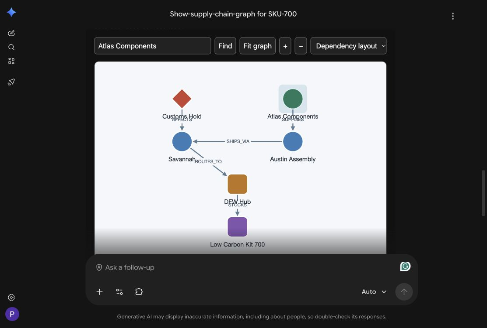

# Develop A2A Agentic AI with Oracle AI Database and Google Gemini including Oracle AI Database Agent in Gemini Enterprise

Standalone repository: [paulparkinson/oracle-ai-database-gcp-gemini](https://github.com/paulparkinson/oracle-ai-database-gcp-gemini). See [migration notes](MIGRATION.md) and [included development skills](AGENTS.md).

This project contains the Oracle AI Database and Google Gemini A2A demo shown in Google Next presentations. It demonstrates how Gemini Enterprise can call A2A agents backed by Oracle AI Database, including graph, spatial, Select AI, inventory-risk, and action-recommendation flows.

The Java agent runtime is the implementation used in the live demo. The Python and Go agents are included as work in progress and reference implementations while they continue to evolve.

[Read the implementation blog](https://paulparkinson.github.io/oracle-ai-database-gcp-gemini/blog.html), including the deployment architecture, database entity model, SQL setup, A2A agents, Gemini Enterprise registration, verification results, and remaining prerequisites.

## Managed-agent catalog, interactive map and graph

For the current interactive catalog/map flow, start with
[Managed Oracle agent + MCP App](docs/MCP_APP_ORACLE_AGENT_SPATIAL.md), including
dynamic prompts, screenshots, local/cloud setup and a three-level provenance
check. The MCP server offers **List-inventory-items**,
**Show-inventory-spatial-hotspots** and **Show-supply-chain-graph** on the same
**Oracle Supply-Chain MCP App** connector. After deploying a tool change, reload
custom actions and enable the new action; existing registrations do not update themselves.

For the interactive **Cytoscape.js** graph, see the
[graph runbook](docs/MCP_APP_ORACLE_AGENT_GRAPH.md). Ask “Use Show-supply-chain-graph
for SKU-700.” Pan, zoom, drag nodes, change layouts, and click nodes/edges for
database IDs and relationships. This action returns structured data, not a
generated picture. The managed agent queries `SC_SUPPLY_CHAIN_GRAPH_V`, whose
Oracle definition uses SQL/PGQ `GRAPH_TABLE`/`MATCH` on `SUPPLY_CHAIN_GRAPH`,
not relational joins. See the runbook for setup and independent verification.



Try “Show the spatial hotspot map for SKU-700” or “Show the spatial hotspot map
for SKU-APAC-210.” List the catalog first to discover other available products.
SKU-501 demonstrates `NO_DATA`/unknown risk in this demo, not zero risk.

```text
Gemini Enterprise → MCP App server → Java gateway
  → OAuth token exchange/cache → Oracle AI Database Agent via A2A
    → validated spatial JSON → MapLibre MCP App
```

These are live reads of seeded Oracle demo tables. This path accepts no
model-supplied evidence and has no Toolkit, Google Search or static-data
fallback. The [gateway rationale and verification guide](docs/MCP_APP_ORACLE_AGENT_SPATIAL.md)
explain server-side credentials, the stored-grant identity, and why a source
label/task ID alone is not independent SQL execution proof. Transfers remain
the separate **Oracle Supply-Chain A2UI** agent and Toolkit review/approval
lane. The older Java inventory-action coordinator is a different, draft-only
surface. Use the [tested demo sequence](docs/INVENTORY_UI_ARCHITECTURE.md#suggested-demo-sequence).


For ChatGPT/Claude-assisted use or maintenance, ask it to read
[the user-facing inventory skill](.agents/skills/inventory-ui-architecture/SKILL.md)
and the linked runbook first. In a Codex environment that discovers this skill,
invoke `$inventory-ui-architecture`. The step-by-step
[workshop lab](https://github.com/paulparkinson/developer/blob/main/multicloud-gcpagenticai-oracledb/a2ui-mcpapps/a2ui-mcpapps.md)
covers both lanes. Application changes belong in **this repository**, not
`oracle-ai-for-sustainable-dev`.

## Watch the recorded presentation

[](https://www.youtube.com/watch?v=lU8UAwmBMeQ)

[Watch on YouTube](https://www.youtube.com/watch?v=lU8UAwmBMeQ)

## LiveLabs Workshop

This content will soon also be a part of the, already existing, Oracle LiveLabs workshop where you can find other examples as well:

[Develop A2A Agentic AI with Oracle AI Database and GCP Gemini](https://livelabs.oracle.com/ords/r/dbpm/livelabs/view-workshop?wid=4330)

## What This Repo Demonstrates

This repo is set up for multiple A2A-style agents. The common pattern is:

1. A caller, such as Gemini Enterprise, sends a user message to an agent over A2A.
2. The agent runtime interprets the message with deterministic routing, Gemini-backed reasoning, Oracle AI Database, or a combination of those pieces.
3. The agent calls local tools or database-backed services.
4. The tool returns structured data, text, or generated image artifacts.
5. The agent returns a final A2A response to Gemini Enterprise.

The broader multi-agent presentation flow is (separate from the bounded MCP
read path above):

1. Gemini Enterprise calls the Marketplace-delivered Oracle AI Database Agent to ask which products are at risk of stockouts.
2. The managed agent invokes the in-database `ORACLE_AI_DATABASE_AGENT` team and its narrow Select AI profile to identify risk drivers by product, warehouse, county, and region under the signed-in database user's identity.
3. A spatial specialist renders hotspot maps for warehouse and regional risk.
4. A graph specialist renders Oracle Database property graph supply-chain dependencies.
5. The custom Select AI agent remains a development and fallback surface, but the presented Gemini Enterprise flow uses the managed Oracle AI Database Agent for database-grounded analysis.
6. An inventory-action coordinator gathers the graph, spatial, and inventory evidence and recommends the safest next move.

## Agent Implementations

- [oracle_agent_java](./oracle_agent_java/README.md): the Java/Spring Boot A2A runtime used in the demo. It serves the graph, spatial, Select AI, inventory-system, and inventory-action agent surfaces from one process.
- [oracle_agent_python](./oracle_agent_python/README.md): Python agent work in progress and earlier reference implementation.
- [oracle_agent_golang](./oracle_agent_golang/README.md): Go agent work in progress.

Use the Java runtime when recreating the Google Next demo.

For the active `adb-pm-prod` / `paulparkdb` reconciliation, follow
[docs/ADB_PM_PROD_REDEPLOYMENT.md](./docs/ADB_PM_PROD_REDEPLOYMENT.md). It keeps the existing shared VM and database, starts with a read-only audit, and uses Oracle's pinned official in-database agent installer.

## Java Runtime Quick Start

From this directory:

```bash
cd oracle_agent_java
./build.sh
./run.sh
```

In another shell, test the local A2A endpoint:

```bash
cd oracle_agent_java
./test.sh
```

For Gemini Enterprise, the agent must be reachable over HTTPS. The full setup, certificate, import, and test details are in:

- [oracle_agent_java/README.md](./oracle_agent_java/README.md)
- [oracle_agent_java/HTTPS_SETUP.md](./oracle_agent_java/HTTPS_SETUP.md)
- [docs/GEMINI_ENTERPRISE_AGENT_SETUP.md](./docs/GEMINI_ENTERPRISE_AGENT_SETUP.md)

## Gemini Enterprise Agent Cards

The Java process serves these demo agent cards:

- Graph agent: `https://YOUR_PUBLIC_AGENT_HOST/agent-card-graph.json`
- Spatial agent: `https://YOUR_PUBLIC_AGENT_HOST/agent-card-spatial.json`
- Select AI agent: `https://YOUR_PUBLIC_AGENT_HOST/agent-card-select-ai.json`
- Inventory-system gateway: `https://YOUR_PUBLIC_AGENT_HOST/agent-card-inventory-system.json`
- Inventory-action coordinator: `https://YOUR_PUBLIC_AGENT_HOST/agent-card-action.json`

The inventory-system gateway can delegate general inventory and database-style questions to the Oracle AI Database Agent, while keeping graph and spatial routing local to this demo runtime.

## Suggested Gemini Enterprise Prompts

Oracle AI Database Agent in Gemini Enterprise:

```text
Which products are at risk of stockouts next quarter, and which regions are driving that risk?
```

Use `oracle_select_ai_agent` only as an explicitly identified fallback or
comparison. It should not replace the managed Marketplace agent in the primary
demo.

Spatial MCP App (schematic connection, not route optimization):

```text
Show the spatial hotspot map for SKU-700 and explain the returned warehouse roles and hotspot scores.
```

Graph:

```text
Use the Oracle Database property graph to show supply chain dependencies for a product and render the graph as an image.
```

Inventory action:

```text
What inventory action should we take for a product with current supply risk? Gather graph, spatial, and external evidence first, then recommend the safest next move and say whether approval is required.
```

## Configuration

This README uses placeholders such as `YOUR_PUBLIC_AGENT_HOST`, `YOUR_VM_SSH_USER`, `YOUR_SELECT_AI_PROFILE_NAME`, and `/path/to/repo-root`. Replace them with your own values before running the demo.

The repo-level `.env` file holds shared settings used by the agent scripts:

```bash
GOOGLE_GENAI_USE_VERTEXAI=true
GOOGLE_CLOUD_PROJECT="your-gcp-project"
GOOGLE_CLOUD_LOCATION="us-east4"
PUBLIC_HOST="YOUR_PUBLIC_AGENT_HOST"
PUBLIC_PROTOCOL="https"
GRAPH_AGENT_PORT="443"
MODEL_NAME="gemini-2.0-flash"
VISUAL_RENDERER="deterministic"
GEMINI_IMAGE_MODEL="gemini-3.1-flash-image"
```

If you use Vertex AI credentials, authenticate Application Default Credentials with:

```bash
./auth.sh
```

If you use a Gemini API key instead, set:

```bash
GOOGLE_API_KEY="your-api-key"
```

For database-managed Select AI, the repository keeps the Google and OpenAI
profiles independent. The current OpenAI path uses credential `OPENAI_CRED`,
profile `PAULPARK_SUPPLY_CHAIN_OPENAI`, and the same narrow `FINANCIAL.SC_*`
object allowlist as the Google profile. See [sql/README.md](./sql/README.md) for
the controlled installation sequence. A provider profile does not change the
A2A cards or Gemini Enterprise topology.

The maintained MCP read paths are interactive MapLibre and Cytoscape.js apps,
not image generators. The obsolete spatial Java2D/JTS renderer, seeded spatial
fallback and its bundled basemap files have been removed. Legacy `/graph` A2A
image/payload examples remain separate compatibility surfaces; `VISUAL_RENDERER`
and `GRAPH_DATA_MODE` do not control the new MCP graph action. Do not use those
legacy examples to demonstrate managed-agent provenance. Select AI and the
inventory-action coordinator are separate demo surfaces.

## Documentation Index

- [docs/INVENTORY_UI_ARCHITECTURE.md](./docs/INVENTORY_UI_ARCHITECTURE.md): the two-lane inventory design—MCP Apps for graph/spatial exploration and A2UI for agent-driven transfer review.

Start here:

- [docs/GEMINI_ENTERPRISE_AGENT_SETUP.md](./docs/GEMINI_ENTERPRISE_AGENT_SETUP.md): Gemini Enterprise import URLs, tested prompts, caveats, and expected behavior.
- [docs/ADB_PM_PROD_REDEPLOYMENT.md](./docs/ADB_PM_PROD_REDEPLOYMENT.md): exact shared-VM and `paulparkdb` reconciliation runbook, including the managed Oracle AI Database Agent.
- [oracle_agent_java/README.md](./oracle_agent_java/README.md): Java runtime, local build/run commands, HTTPS deployment, and agent card URLs.
- [docs/DEMO_NOW_AND_NEXT.md](./docs/DEMO_NOW_AND_NEXT.md): current demo status and next steps.
- [docs/GCP_INFRA_SETUP.md](./docs/GCP_INFRA_SETUP.md): GCP setup and migration guide.
- [docs/GCP_SETUP_PROGRESS.md](./docs/GCP_SETUP_PROGRESS.md): live migration notes and setup progress.
- [docs/TODO.md](./docs/TODO.md): follow-up work, hardening, and roadmap items.

Reference docs:

- [docs/README.md](./docs/README.md)
- [docs/ADK_AGENT_README.md](./docs/ADK_AGENT_README.md)
- [docs/ADK_RAG_IMPLEMENTATION.md](./docs/ADK_RAG_IMPLEMENTATION.md)
- [docs/AGENT_FILES_COMPARISON.md](./docs/AGENT_FILES_COMPARISON.md)
- [docs/AGENT_README.md](./docs/AGENT_README.md)
- [docs/API_README.md](./docs/API_README.md)
- [docs/DIRECTORY_STRUCTURE.md](./docs/DIRECTORY_STRUCTURE.md)
- [docs/EMBEDDINGS_COMPARISON.md](./docs/EMBEDDINGS_COMPARISON.md)
- [docs/MCP_IMPLEMENTATION_SUMMARY.md](./docs/MCP_IMPLEMENTATION_SUMMARY.md)
- [docs/MCP_TOOLBOX_README.md](./docs/MCP_TOOLBOX_README.md)
- [docs/QUICK_START_ADK_MCP.md](./docs/QUICK_START_ADK_MCP.md)
- [docs/QUICK_START_SUMMARY.md](./docs/QUICK_START_SUMMARY.md)
- [docs/TESTING_RESULTS.md](./docs/TESTING_RESULTS.md)
- [docs/WORKSHOP.md](./docs/WORKSHOP.md)
- [docs/oracle_ai_database_adk_agent.md](./docs/oracle_ai_database_adk_agent.md)

## Notes

- The Java runtime is the one to use for the recorded and presented demo.
- Python and Go agents are under development.
- The YouTube thumbnail is loaded from YouTube so no separate image asset is required in this repo.
- Use [docs/GEMINI_ENTERPRISE_AGENT_SETUP.md](./docs/GEMINI_ENTERPRISE_AGENT_SETUP.md) for the most complete Gemini Enterprise import and test runbook.
