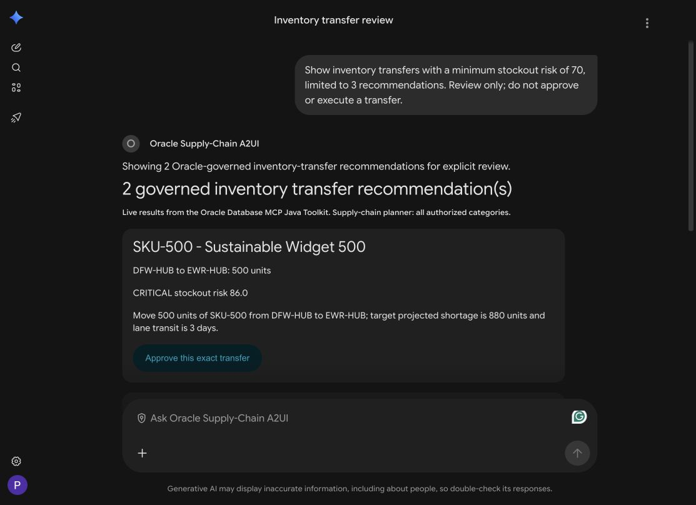

# Inventory UI architecture: MCP Apps and A2UI

This project deliberately demonstrates two UI paths for the same inventory and
supply-chain domain. The split is based on interaction style, not on a claim
that one protocol owns a particular business subject.

## The two lanes

```text
Gemini Enterprise inventory app
├── Explore
│   ├── MCP App: spatial warehouse hotspots
│   └── MCP App: property-graph dependencies
└── Decide and act
    └── Oracle Supply-Chain A2UI agent → Toolkit-backed review/approval
```

### MCP Apps: explore

Use an MCP App when the user wants a rich, interactive, primarily read-only
view: maps, graph traversal, filters, drill-downs, or comparison controls.
The host invokes a bounded MCP tool, receives structured Oracle-backed data,
and loads the associated `ui://` resource in a sandbox.

```text
user selects SKU
  → MCP tool or MCP-backed adapter
  → governed Oracle query / Oracle-backed agent
  → structured result
  → sandboxed spatial or graph MCP App
```

The MCP App is presentation code. It does not receive database credentials and
must not choose a different SKU, route, quantity, or database operation than
the server returned.

### A2UI: decide and act

Use A2UI when an agent must synthesize evidence and present a workflow: risk
explanation, recommended transfer, policy result, approval state, and the next
user action.

```text
user asks for inventory-transfer recommendations
  → existing Oracle Supply-Chain A2UI agent via A2A
  → Java review API → governed Toolkit recommendation query
  → exact recommendation and short-lived review handle
  → A2UI review controls
  → explicit authenticated approval
  → governed server/database write path
```

A2UI is a declarative UI contract, not an orchestration engine. The A2A
adapter calls the review API and constructs the A2UI messages. The
database remains the final authority for authorization, current-stock
revalidation, row locking, audit, and the transaction.

## Current implementation boundary

The **Oracle Supply-Chain MCP App** server exposes
`list-inventory-items`, `show-inventory-spatial-hotspots` and
`show-supply-chain-graph`. All read through
the Java gateway's server-side OAuth/A2A call to the managed Oracle AI Database
Agent. The spatial tool accepts a SKU, not Gemini-supplied evidence, and never
falls back to Toolkit/Select AI/static payloads. Its MapLibre resource displays
validated warehouse rows from seeded Oracle demo tables. See the
[read-path runbook](MCP_APP_ORACLE_AGENT_SPATIAL.md) for dynamic prompts,
screenshots, gateway rationale, and independent verification limits.

The graph action uses bundled Cytoscape.js and a separate `ui://` resource,
not a PNG. The managed agent reads `SC_SUPPLY_CHAIN_GRAPH_V`, an Oracle view
traversing `SUPPLY_CHAIN_GRAPH` with SQL/PGQ `GRAPH_TABLE`/`MATCH`, not joins or local JDBC. See the
[graph runbook](MCP_APP_ORACLE_AGENT_GRAPH.md) for tests, scope and connector
refresh steps. The toolkit descriptors below remain reference surfaces;
they do not automatically register this action. The stored Oracle grant identifies the
gateway's upstream caller; it is not automatic per-Gemini-user delegation.

For the demo's decision lane, select the existing **Oracle Supply-Chain A2UI**
agent in Gemini Enterprise. Its separate GCP service, `oracle-supply-chain-a2ui`,
returns native A2UI recommendation cards backed by the Oracle Database MCP Java
Toolkit, with **Approve this exact transfer** and **Cancel review without writing**
controls. A review prompt does not execute a transfer. This is distinct from
the older `oracle_inventory_action_agent` on the VM and the draft-only
`InventoryActionAdkService` in `oracle_agent_java/`; do not confuse those surfaces.

The existing [review/approval API](../agent-service/src/main/java/com/oracle/demo/interactiveai/AgentController.java)
binds the selected recommendation to a short-lived, single-use review handle.
The write path is through the Toolkit, not the managed read agent. The current
demo uses a configured service actor; do not describe it as per-user identity
delegation or a production authorization audit.

On October 4, 2026, a Gemini host test rendered SKU-500 (500 units,
DFW-HUB → EWR-HUB) and WATER-SENSE (51 units, ATL-DC → SEA-FC) at minimum
risk 70. No approval was clicked and no write was tested in this validation.
Those are dated results, not hardcoded expectations for every run.

The full-stack toolkit seeds the complementary MCP App descriptors:

- `inventory-spatial-mcpapp` — interactive spatial exploration
- `inventory-graph-mcpapp` — interactive dependency exploration
- `inventory-transfer-a2ui` — A2A/A2UI review surface, with MCP App disabled

## Implementation responsibilities

1. Prepare the governed Oracle inventory, warehouse, graph, and spatial data.
2. Expose bounded read-only MCP tools for graph and spatial evidence.
3. Associate those tools with `ui://` MCP App resources and register them with
   an MCP Apps-compatible host.
4. Expose the review adapter through A2A with the A2UI extension
   and the host-approved catalog.
5. Have the review service query governed recommendations and issue an exact,
   short-lived review handle. Do not infer quantity from a spatial risk score.
6. Render the draft and approval controls as A2UI.
7. Keep the write path separate: bind approval to the authorized actor and
   exact draft, make the approval handle short-lived and single-use, revalidate
   current inventory in Oracle, lock the affected rows, write the transfer and
   audit records in one transaction, and return the committed result.
8. Test rejection, expiry, replay, actor mismatch, changed quantities/routes,
   insufficient stock, and transaction rollback before enabling production
   writes.

## Suggested demo sequence

1. List the managed catalog, then map SKU-700 and SKU-APAC-210 to demonstrate
   parameterized spatial reads. Inspect point details and schematic connections.
2. Enable `Show-supply-chain-graph` on the same connector and ask for SKU-700,
   then SKU-900. Inspect supplier → plant → port → warehouse → product edges
   and alert → port links. This is dependency evidence, not a transfer approval.
3. Select **Oracle Supply-Chain A2UI** under Agents. Ask:
   `Show inventory transfers with a minimum stockout risk of 70, limited to 3 recommendations. Review only; do not approve or execute a transfer.`
4. Review the native A2UI cards. This service independently queries its Toolkit
   recommendation dataset; it does not automatically receive the preceding
   map/graph conversation. Spatial scores do not determine transfer quantities.
5. For a read-only demo, choose **Cancel review without writing**. Only if you
   intend an actual database write, inspect the exact SKU, route and quantity,
   then click **Approve this exact transfer**. Do not use a prose prompt as a
   substitute for the explicit approval control. Refresh an expired review.



Related implementation and workshop material:

- [`oracle_agent_java/README.md`](../oracle_agent_java/README.md)
- [`a2ui-mcpapps/a2ui-mcpapps.md`](https://github.com/paulparkinson/developer/blob/main/multicloud-gcpagenticai-oracledb/a2ui-mcpapps/a2ui-mcpapps.md)
- [`oracle-ai-database-fullstack-toolkit`](https://github.com/paulparkinson/oracle-ai-database-fullstack-toolkit)
