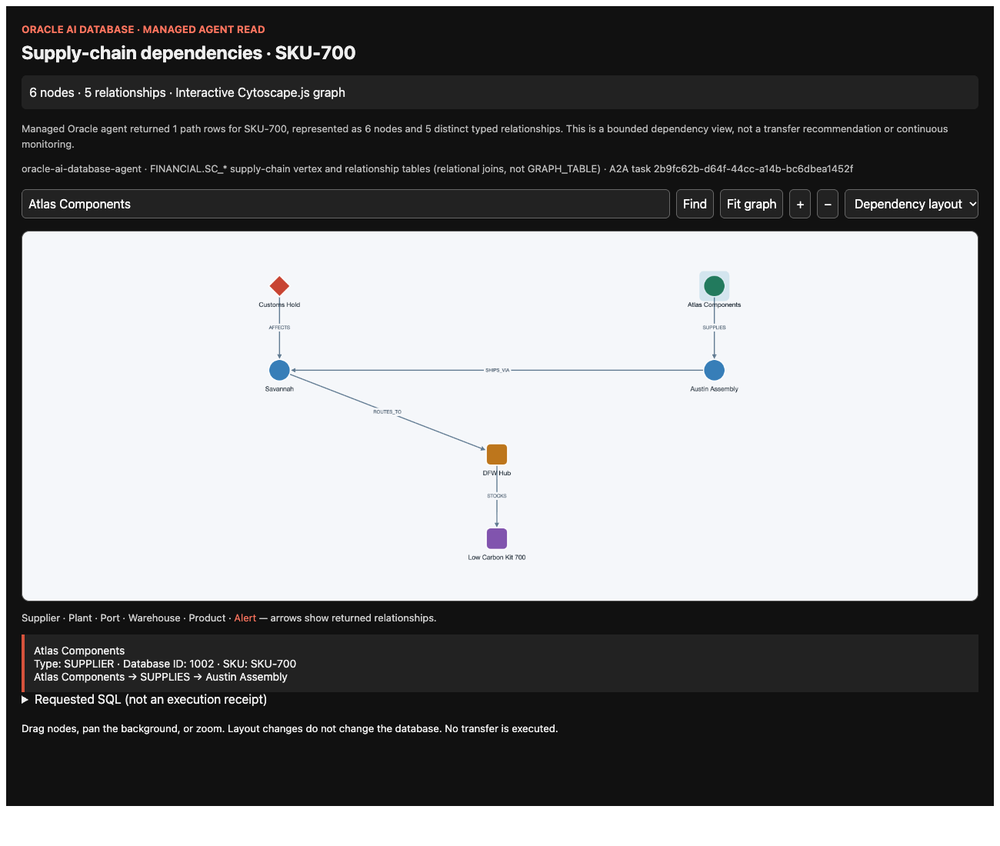
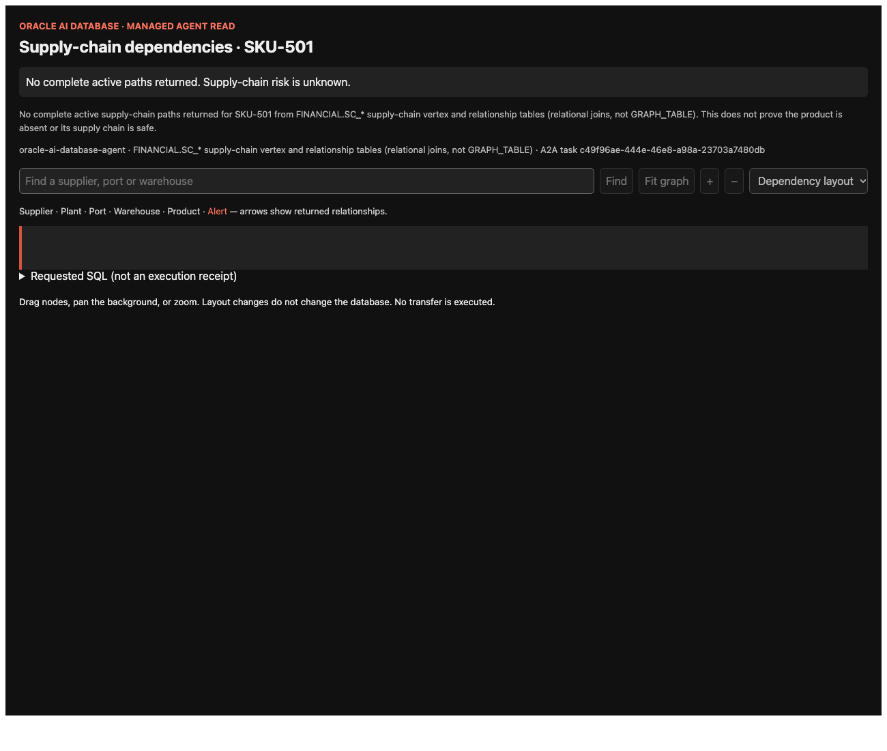
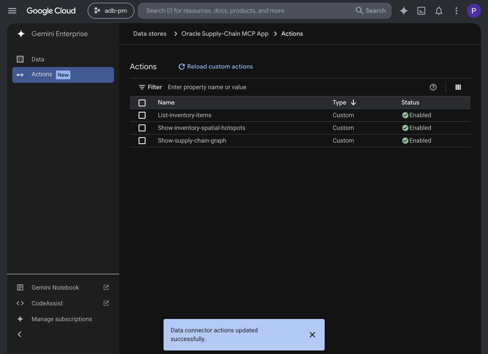

# Managed Oracle agent → interactive Cytoscape.js graph

The `show-supply-chain-graph` MCP tool accepts **only a SKU**. It fetches fresh
managed-agent evidence server-side and opens a bundled Cytoscape.js MCP App.
It does not generate a picture or accept nodes/edges supplied by Gemini.

```text
Gemini Enterprise → same Oracle Supply-Chain MCP App connector
  → show-supply-chain-graph(sku) → Java gateway
    → server-side OAuth → managed Oracle AI Database Agent via A2A/private relay
      → SC_* relationship query → validated rows → typed nodes/edges
        → ui://oracle-supply-chain/supply-chain-graph-v1 → Cytoscape.js
```

## Query scope and interpretation

This is an explicit **relational traversal of the property graph's backing
tables**, not verified `GRAPH_TABLE` execution. During development the managed
agent rewrote a simple GRAPH_TABLE request and failed the full graph-pattern
request. The supported implementation therefore explicitly requests the
SC_* table joins exposed by the existing managed-agent profile. There is no
automatic alternate data path, no direct JDBC query, and no database/profile
change is required by this application update.

`OracleGraphEvidenceService.query()` is the canonical requested SQL. It joins
SC_SUPPLIERS → SC_SUPPLIER_PLANT → SC_PLANTS → SC_PLANT_PORT → SC_PORTS →
SC_PORT_WAREHOUSE → SC_WAREHOUSES → SC_WAREHOUSE_PRODUCT → SC_PRODUCTS,
with optional SC_ALERT_PORT/SC_ALERTS. Only active vertices/current relationships
are requested. CHR(89) expresses the schema's Y flag without embedded quoted
literals. PRODUCT_ID is retained on every row and filtered in Java.

- Relationships: SUPPLIES, SHIPS_VIA, ROUTES_TO, STOCKS and optional AFFECTS.
- Nodes preserve database IDs and names. Edge keys identify distinct typed
  relationships for the UI; they are **not Oracle edge-table primary keys**.
- Exact duplicates collapse; conflicting identities, missing fields, invalid
  JSON, missing task IDs and oversized results fail closed. At 1,000 rows the
  result is rejected because the upstream SQL tool caps rows at 1,000; it must
  not be presented as complete. The UI is limited to 500 nodes/1,000 edges.
- NO_DATA means no complete active path in this query, **not** no product,
  no upstream dependencies, or a safe supply chain. Catalog membership alone
  does not establish a graph path.
- These are live reads of seeded Oracle demo tables, not production telemetry.
  Layout, dragging and zooming only inspect the returned result. Ask again for
  a new read. No transfer, inventory write or monitoring is performed.

## Run it in Gemini Enterprise

1. Deploy the gateway and MCP server as below. Use the existing **Oracle
   Supply-Chain MCP App** connector; do not create a second connector.
2. In its **Actions** tab choose **Reload custom actions**, then enable
   **Show-supply-chain-graph** alongside catalog and spatial actions. Keep the
   transfer dashboard disabled. Start a fresh chat with this connector enabled.
3. Try these prompts:

| Prompt | Check |
| --- | --- |
| `Use List-inventory-items to list the managed Oracle inventory catalog and its scope.` | Discover current product IDs; do not assume every product has graph evidence. |
| `Use Show-supply-chain-graph for SKU-500.` | Interactive dependency graph, not a PNG. |
| `Use Show-supply-chain-graph for SKU-700. Explain only the returned nodes and relationships.` | A different product/path; inspect supplier and alert IDs. |
| `Show the supply-chain dependency graph for SKU-900 using Show-supply-chain-graph.` | Another managed-agent request/task ID and product-specific nodes. |
| `Use Show-supply-chain-graph for SKU-501. Do not substitute another product if no data exists.` | Explicit NO_DATA; no invented graph. |

4. Click a node for its Oracle ID/name/type and adjacent relationships. Click
   an edge for its endpoints/type. Drag a node, pan the background, zoom, choose
   another layout, search by node name/ID/type, then **Fit graph**.



*Actual browser screenshot, October 4, 2026: live Oracle-agent result in a local
MCP protocol test host, not a mock graph and not a Gemini Enterprise screenshot.*



## Build, test and deploy

### Verified deployment, October 4, 2026

- Existing GCP gateway revision: `oracle-inventory-agent-gateway-00004-shb`.
- Existing MCP revision: `oracle-supply-chain-mcp-gemini-00035-4xg`.
- The same connector now has all three read actions enabled; no new connector.
- Deployed browser-protocol tests passed for SKU-500 (task
  `dbef82fa-4ea3-4670-8218-37b05f4a8a56`), SKU-700
  (`3a5db924-bbda-4542-a78b-b4116438c994`) and SKU-501 NO_DATA
  (`b23b0fe2-f38e-4798-be37-5dece7d42db4`). SKU-900 also passed through the
  local gateway using the live managed agent, not a fixture.
- Gemini Enterprise itself rendered SKU-700, task
  `804e27c7-7149-4d0e-a346-e7529682c1c6`, with Google Search disabled. Search,
  Fit graph and a real DFW Hub node click were verified; DFW returned ID 4002
  with ROUTES_TO/STOCKS relationships. The broader pan/zoom/drag/layout/edge
  interaction checks passed in the automated browser protocol host.
- Deployed catalog and spatial regression checks passed for SKU-500, SKU-700,
  SKU-APAC-210 and the SKU-501/GRID-CTRL no-data cases.
- Java tests: 13 passed. MCP contract/concurrency/failure tests: 3 passed.
  No independent Oracle-side SQL audit correlation was performed in this run.
- Dependency audit reported four existing production transitive advisories
  (one high, three moderate: fast-uri, hono, ip-address, qs). No claim of a
  security-clean or production-hardened deployment is made; review/update
  those dependencies and public ingress before production use.




### Reproduce the tests

Use Java 21/Maven, Node 20.19+ or 22.12+, and Chrome for the browser test. Follow
the [existing OAuth/local gateway setup](MCP_APP_ORACLE_AGENT_SPATIAL.md#local-verification)
first. OAuth client credentials and the refresh grant stay server-side; never
put them in the MCP resource, tool arguments, screenshots or Git.

From the application repository root:

```bash
cd oracle_agent_java
mvn clean test package
cd ../mcp-app
npm ci --ignore-scripts
npm run typecheck
npm run build
node --import tsx --test test/graph-contract.test.mjs test/concurrent-requests.test.mjs
```

With the configured Java gateway listening on 18090, start MCP in another shell:

```bash
cd mcp-app
ORACLE_SPATIAL_EVIDENCE_URL=http://127.0.0.1:18090/api/inventory/spatial-hotspots \
MCP_WRITES_ENABLED=false MCP_BIND_HOST=127.0.0.1 PORT=13001 npm run serve
```

The graph endpoint uses the **same configured gateway origin**; no second
credential or graph connector is needed. Test raw evidence and actual UI:

```bash
curl --fail-with-body --max-time 150 \
  'http://127.0.0.1:18090/api/inventory/supply-chain-graph?sku=SKU-700'
cd mcp-app
node test/graph-ui.mjs http://127.0.0.1:13001/mcp SKU-700 /tmp/graph-sku700.png
node test/graph-ui.mjs http://127.0.0.1:13001/mcp SKU-900
node test/graph-ui.mjs http://127.0.0.1:13001/mcp SKU-501 /tmp/graph-no-data.png
```

The Java/contract tests use labeled fixtures. The browser script calls the real
MCP server and loads its real resource in a minimal protocol host under a
no-network CSP, then checks pan/zoom/drag/layout/search/node-and-edge details.
It is **not** a substitute for a Gemini Enterprise host test.

After tests, deploy from the repo root (requires authorization to update the
existing Cloud Run services and the existing Secret Manager prerequisites):

```bash
./deploy/gcp/deploy-oracle-agent-and-mcp-app.sh
```

The script builds both images, updates the existing gateway/MCP services and
prints their URLs. `.gcloudignore` excludes local secrets/build artifacts;
MCP dependencies are installed from the lockfile. Repeat the browser commands
with the printed HTTPS MCP URL, then reload/enable the connector action above.
The deployment retains public demo ingress; production requires caller
authorization. Stored upstream OAuth is not automatic per-user delegation.

## Verify the source, not just the picture

Follow the [three-level provenance procedure](MCP_APP_ORACLE_AGENT_SPATIAL.md#verify-provenance-not-just-a-working-map).
The host must invoke `Show-supply-chain-graph`; a `Load Skill` or Google Search
event does not establish a database read. Check the raw result's `sku`, node
database IDs, typed edges, `scope`, `taskId`, `executionMode` and requested
`query`. Check the server's authenticated A2A path and compare rows with an
authorized independent Oracle read/audit when stronger proof is required.
The managed agent itself uses an LLM; schema validation cannot make its text
output a signed SQL execution receipt. A task ID proves correlation, not SQL
execution by itself. Do not relabel source strings to manufacture provenance.

If OAuth, the managed query, JSON validation or host connection fails, report
that failure. Do not render previous results, Toolkit data, Gemini-invented
nodes or static examples. A 502 alone does not diagnose a database outage.

## Implementation and cleanup

- Java: `OracleGraphEvidenceService`, `/api/inventory/supply-chain-graph`.
- MCP: `server.ts`, `src/graph-contract.ts`, `src/graph-app.ts`, `graph-app.html`.
- Cytoscape.js is bundled with the resource; no CDN/API key/network connection
  is needed for graph rendering. See [Cytoscape.js documentation](https://js.cytoscape.org/).
- The old spatial Java2D/JTS picture generator, seeded fallback and three
  bundled basemap GeoJSON files were removed; Git history retains them.
- Legacy `/graph` A2A image/payload examples remain compatibility code, entirely
  separate from this action. Do not use them as managed-MCP provenance evidence.
- Transfer review remains the A2A/A2UI lane; the current Java implementation is
  draft/review, not a tested inventory write. Removing the seeded spatial
  helper also removes its invented transfer quantity: the deterministic action
  path now returns insufficient-transfer-evidence when no governed quantity
  and endpoints are available, rather than manufacturing a draft.
